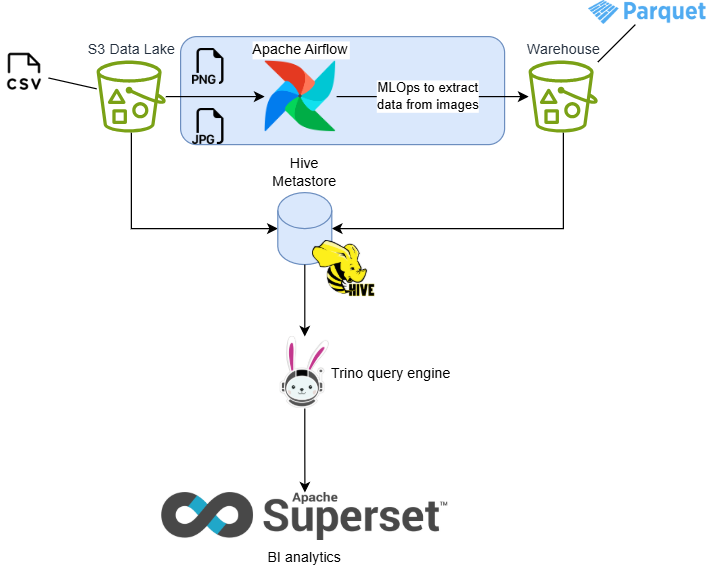

#  Invoice Data Platform
**A sample data pipeline for transforming invoice images and CSV files into BI Service Dashboards**

## Summary
TL;DR  
  

## Requirement
- **[Docker for Desktop](https://www.docker.com/products/docker-desktop/)** (Enable Kubernetes and WSL2) or **minikube**
- [Helm](https://helm.sh/docs/intro/install/)
- Python 3.12 ([Microsoft store](https://apps.microsoft.com/search?query=python+3.12))
- openssl: generate secrets for SuperSet and cert for Trino
    - For Windows users: just install [Git for Windows](https://gitforwindows.org/), it'll be included in Git Bash console
- \>16GB RAM. Preferably 32GB

## Quick Start
TL;DR
```bash
(cd ./k8s && ./deploy.sh)
```

Many services are of type NodePort, run `kubectl get svc -n everest` to get their exposed port numbers. Go to [defaults.sh](./k8s/defaults.sh) 
to see default login credentials.

Step-by-step [guide](./guide/README.md)
