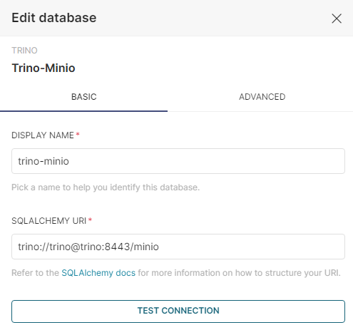

### 1. **Set up local environment**
```bash
(cd ./k8s && ./deploy.sh)
```
---
### 2. **Review Data Lake Configuration**
Ensure you can access the Minio console at [http://localhost:31001](http://localhost:31001)
- **Username:** `admin`
- **Password:** `console1234`


Confirm that the setup script has created the following buckets:
- **lake:** Stores raw invoice images and unprocessed CSV transaction files
- **warehouse:** Initially empty

> Note: The `warehouse` bucket will be populated with extracted data in Parquet format 
after the pipeline execution.
---
### 3. **Run Data Pipeline**
Access the pipeline dashboard at [http://localhost:30080](http://localhost:30080)
- **Username:** `airflow_admin`
- **Password:** `my_sv_password`

Wait for the DAG to load (~1 minute), a DAG (Directed Acyclic Graph) is a Python script 
that organizes and runs tasks.  


Choose the `process_image` DAG and click the `Trigger` button at the top right.   


Go to the _Graph_ tab to see the pipeline's visual flow and task statuses.  


The code is located [here](../pipe/dags/process_image/process_image.py).  
> To modify Python code in the `/pipe/dags` folder, download [devspace][1] 
and run `devspace dev`. This will sync changes to the Airflow container's special 
directory: _$AIRFLOW_HOME/dags_. The [parser][2] will automatically detect the updates.

The `image_to_json` task is [dynamically mapped][3], creating a task for each image in 
the data lake. It uses Deep Learning for invoice image processing and data extraction. 
This example employs a pretrained model (Donut) on the well-known CORDv2 training dataset. 
Processing speed can be improved by enabling GPU acceleration.

> In real-world scenarios, it is advisable to use **KubernetesExecutor** 
> for managing intensive workloads. This approach ensures that each task 
> is executed in a dedicated Kubernetes pod.

Click the box icon next to the task name and select the _Mapped Tasks_ 
tab for more details.  


After task completion, you should now see **warehouse** bucket filled:  


[1]: https://www.devspace.sh/
[2]: https://airflow.apache.org/docs/apache-airflow/stable/authoring-and-scheduling/dagfile-processing.html
[3]: https://airflow.apache.org/docs/apache-airflow/stable/authoring-and-scheduling/dynamic-task-mapping.html
---
### 4. **Set up Dashboard**
Access the BI app at: [http://localhost:32000](http://localhost:32000)
- **Username:** `admin`
- **Password:** `admin`

#### 1. **Connect to Trino**  
Click the '+' button at the top right to add a new Trino data source.  


In the _Basic_ tab:  

Enter the SQLAlchemy connection string:  
```
trino://trino@trino:8443/minio
```


In the _Advanced_ tab:  

_Security_ > _Secure Extra_:  
```json
{
    "auth_method": "jwt",
    "auth_params": {
        "token": "<your-jwt-token>"
    }
}
```
Retrieve `<your-jwt-token>` token using: 
```bash
kubectl get secret trino -o jsonpath='{.data.jwt_token}' | base64 -d
```

_Security_ > _Root Certificate_: There should be a _.cert_ file created at 
[k8s/airflow/config/trino/certificate.pem](../k8s/airflow/config/trino/certificate.pem) after 
set up  


_SQL Lab_:  


Return to _Basic_ tab and test the connection.

Now you can start writing queries at _SQL Lab_.  


#### 2. **Set up tables**
Run the following query to set up external tables to read parquet files 
from the `lake` and `warehouse` buckets:
```sql
CREATE SCHEMA minio.lake
WITH (location = 's3a://lake/');

CREATE TABLE minio.lake.dirty_cafe_sales (
    Transaction_ID VARCHAR,
    Item VARCHAR,
    Quantity VARCHAR,
    Price_Per_Unit VARCHAR,
    Total_Spent VARCHAR,
    Payment_Method VARCHAR,
    Location VARCHAR,
    Transaction_Date VARCHAR
) WITH (
    format = 'CSV',
    skip_header_line_count = 1,
    external_location = 's3a://lake/'
);

----

CREATE SCHEMA minio.warehouse
WITH (location = 's3a://warehouse/');

CREATE TABLE minio.warehouse.invoices_total (
    subtotal_price double,
    tax_price double,
    service_price double,
    total_price double,
    file_name varchar,
    "date" date
) with (
    format = 'PARQUET',
    external_location = 's3a://warehouse/processed_invoices/total',
    partitioned_by = ARRAY['date']
);

CREATE TABLE minio.warehouse.invoices_menu (
    nm varchar,
    price double,
    cnt int,
    file_name varchar,
    "date" date
) with (
    format = 'PARQUET',
    external_location = 's3a://warehouse/processed_invoices/menu',
    partitioned_by = ARRAY['date']
);

--update Hive metastore
CALL system.sync_partition_metadata('warehouse', 'invoices_total', 'ADD');
CALL system.sync_partition_metadata('warehouse', 'invoices_menu', 'ADD');
```

#### 3. **Visualize results**
I won't go into details on using Superset (that's for the data analyst folks xD), 
but it's quite simple to use and makes creating beautiful charts like this very easy.
